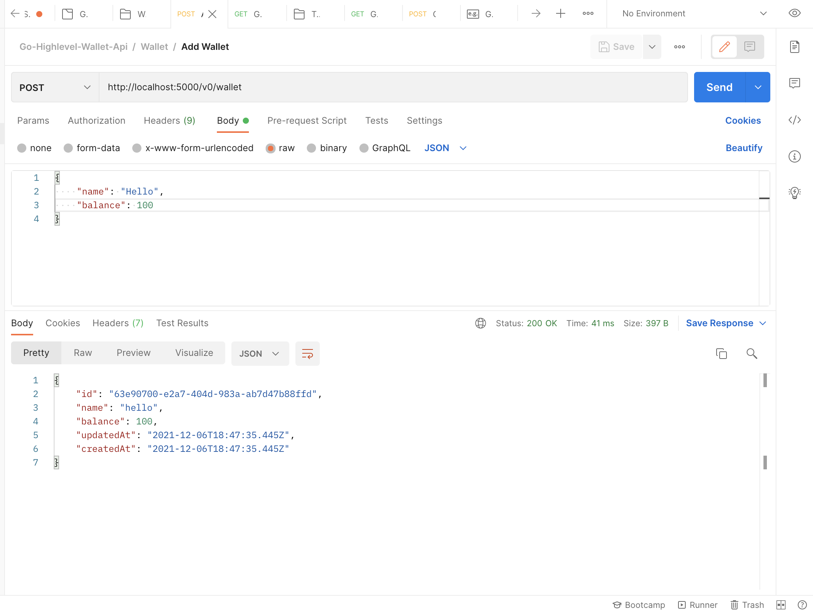
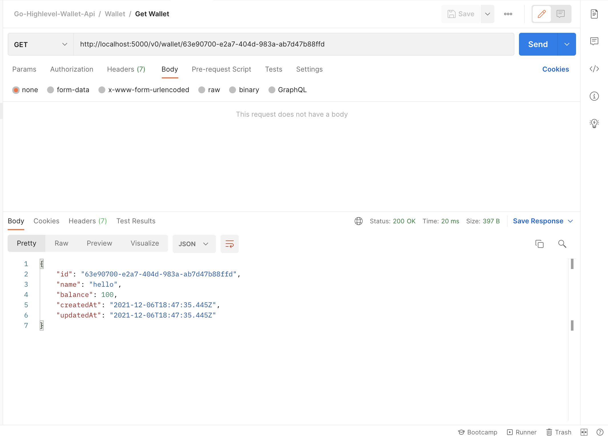
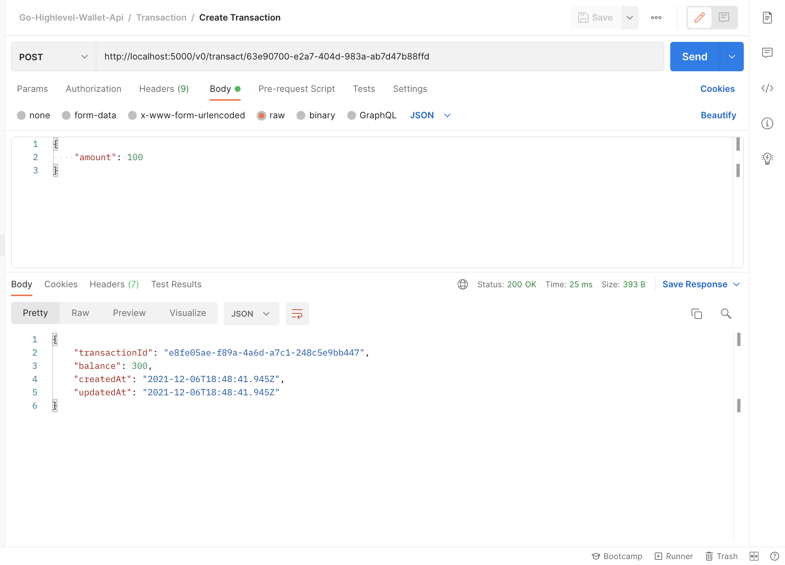

# Go HighLevel - Wallet Api
## Wallet apis commands

#### System Requirements
- NodeJs - 14.x or greater

#### Installing dependencies 
Install all required dependencies
```shell
$ yarn install
```

#### Running in dev mode
Running server in dev mode, it restarts when any changes made in code.
```shell
$ yarn start:dev
```

#### Build
Build production deployable code
```shell
$ yarn build
```

#### Start
Start production code (build)
```shell
$ yarn start
```

#### example.env
Create .env file and put following variables
```dotenv
DB_HOST=<host>
DB_USERNAME=<db_user>
DB_PASSWORD=<db_password>
DB_NAME=<db_name>
DB_PORT=<db_port>
DB_ENABLE_SSL=<enable_ssl_(true/false)>
DB_CA_CONFIG=<ca_certificet_base64_encoded>
```

### Deployed QA server
```
https://go-high-level-wallet-api.azurewebsites.net
```

### API structure

#### Setup wallet
- Setup wallet url
```http request
POST /v0/wallet
```
- Request Body
```javascript
{
  "name": string,
  "balance": number
}
```
- Response
```javascript
{
  "id": string, 
  "name": string,
  "balance": number,
  "updatedAt": date,
  "createdAt": date
}
```

#### Get wallet
- Setup wallet url
```http request
GET /v0/wallet/{walletId}
```
- Response
```javascript
{
  "id": string, 
  "name": string,
  "balance": number,
  "updatedAt": date,
  "createdAt": date
}
```

#### Transact wallet
- Setup wallet url
```http request
POST /v0/transact/{walletId}
```
- Request Body
```javascript
{
  "amount": number
}
```
- Response
```javascript
{
  "transactionId": string, 
  "balance": number,
  "createdAt": date,
  "updatedAt": date
}
```

#### Get transactions
- Setup wallet url
```http request
GET /v0/transactions?walletId={walletId}&skip={number}&limit={number}
```
- Response
```javascript
[
  {
    "id": string,
    "description": string,
    "amount": number,
    "walletId": string,
    "createdAt": date,
    "updatedAt": date
  }
]
```

### Deployed url - Api doc in swagger
```http request
GET https://go-high-level-wallet-api.azurewebsites.net/docs/
```

### Database
Used postgres for SQL db

#### Postman collection
[HERR](docs/postman/collection.json)

#### Demo video

[](docs/video/screen-capture.webm)

#### Screenshots






### File structure
```
├── README.md
├── docs
│   ├── images
│   │   ├── a1.png
│   │   ├── a2.png
│   │   ├── a3.png
│   │   └── a4.png
│   └── postman
│       └── collection.json
├── logs
│   ├── access.log
│   ├── combined.log
│   ├── error.log
│   ├── info.log
│   └── warn.log
├── package.json
├── src
│   ├── app.ts
│   ├── bin
│   │   └── www.ts
│   ├── config
│   │   ├── common.ts
│   │   ├── database.ts
│   │   ├── index.ts
│   │   ├── joiErrorMessages.ts
│   │   ├── logger.ts
│   │   ├── regExp.ts
│   │   └── swagger.ts
│   ├── controllers
│   │   ├── createError.ts
│   │   ├── healthCheck.ts
│   │   ├── index.ts
│   │   ├── serverState.ts
│   │   ├── transaction.ts
│   │   └── wallet.ts
│   ├── helpers
│   │   ├── index.ts
│   │   ├── response.ts
│   │   └── validate.ts
│   ├── models
│   │   ├── common.model.ts
│   │   ├── errorResponse.model.ts
│   │   ├── index.ts
│   │   ├── response.model.ts
│   │   ├── successResponse.model.ts
│   │   ├── transaction.model.ts
│   │   └── wallet.model.ts
│   ├── routes
│   │   ├── index.ts
│   │   └── v0
│   │       ├── healthCheck.ts
│   │       ├── index.ts
│   │       ├── transact.ts
│   │       ├── transactions.ts
│   │       └── wallet.ts
│   ├── services
│   │   ├── common.service.ts
│   │   ├── database.service.ts
│   │   ├── index.ts
│   │   ├── serverState.service.ts
│   │   ├── transaction.service.ts
│   │   └── wallet.service.ts
│   ├── types
│   │   ├── express.ts
│   │   ├── index.ts
│   │   └── wallet.ts
│   └── validators
│       ├── index.ts
│       ├── transaction.ts
│       └── wallet.ts
├── tsconfig.json
└── yarn.lock
```

